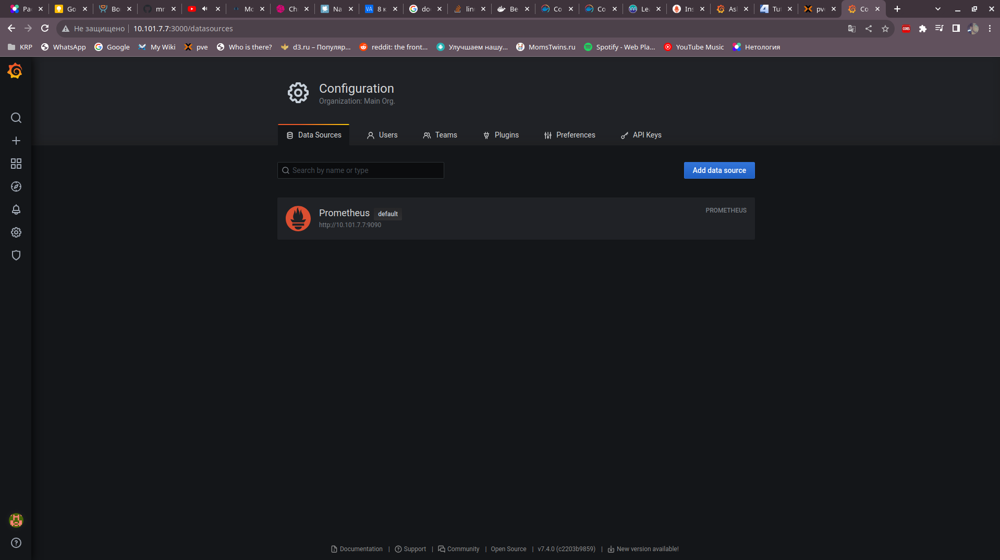
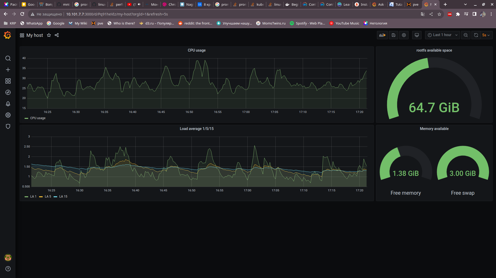
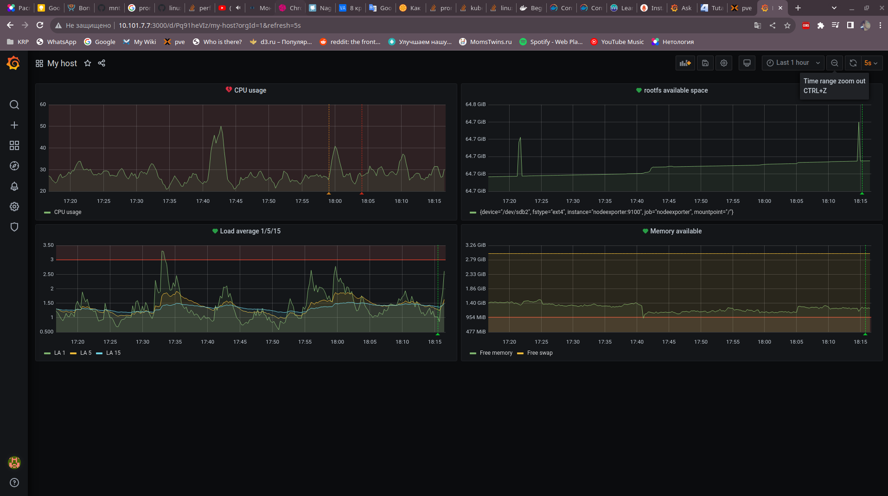
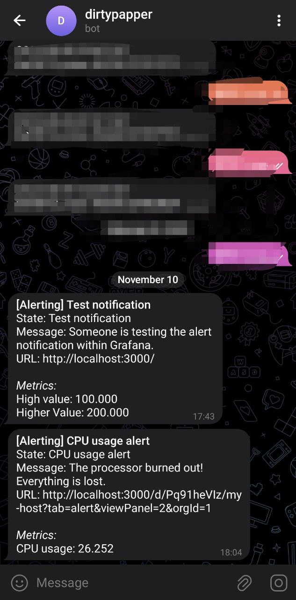

# Домашнее задание к занятию 14 «Средство визуализации Grafana»

## Обязательные задания

## Задание 1

1. Используя директорию [help](./help) внутри этого домашнего задания, запустите связку prometheus-grafana.
1. Зайдите в веб-интерфейс grafana, используя авторизационные данные, указанные в манифесте docker-compose.
1. Подключите поднятый вами prometheus, как источник данных.
1. Решение домашнего задания — скриншот веб-интерфейса grafana со списком подключенных Datasource.

### Ответ



## Задание 2

Изучите самостоятельно ресурсы:

1. [PromQL tutorial for beginners and humans](https://valyala.medium.com/promql-tutorial-for-beginners-9ab455142085).
1. [Understanding Machine CPU usage](https://www.robustperception.io/understanding-machine-cpu-usage).
1. [Introduction to PromQL, the Prometheus query language](https://grafana.com/blog/2020/02/04/introduction-to-promql-the-prometheus-query-language/).

Создайте Dashboard и в ней создайте Panels:

- утилизация CPU для nodeexporter (в процентах, 100-idle);
- CPULA 1/5/15;
- количество свободной оперативной памяти;
- количество места на файловой системе.

Для решения этого задания приведите promql-запросы для выдачи этих метрик, а также скриншот получившейся Dashboard.

### Ответ



**Метрики:**

CPU usage:

```
100 - (avg by (instance) (rate(node_cpu_seconds_total{job='nodeexporter',mode='idle'}[1m])) * 100)
```

Load average 1/5/15:

```
node_load1
node_load5
node_load15
```

rootfs available space:

```
((node_filesystem_size_bytes{mountpoint=\"/\",fstype!=\"rootfs\"} * 100) / \nnode_filesystem_avail_bytes{mountpoint=\"/\",fstype!=\"rootfs\"}) - 100
```

Memory available:

```
node_memory_MemFree_bytes
node_memory_SwapFree_bytes
```

## Задание 3

1. Создайте для каждой Dashboard подходящее правило alert — можно обратиться к первой лекции в блоке «Мониторинг».
1. В качестве решения задания приведите скриншот вашей итоговой Dashboard.

### Ответ



## Задание 4

1. Сохраните ваш Dashboard.Для этого перейдите в настройки Dashboard, выберите в боковом меню «JSON MODEL». Далее скопируйте отображаемое json-содержимое в отдельный файл и сохраните его.
1. В качестве решения задания приведите листинг этого файла.

### Ответ

[my_host_dash.json](my_host_dash.json)

## Задание повышенной сложности

**При решении задания 3** вы должны самостоятельно завести удобный для вас канал нотификации, например, Telegram или email, и отправить туда тестовые события.

В решении приведите скриншоты тестовых событий из каналов нотификаций.

### Ответ

